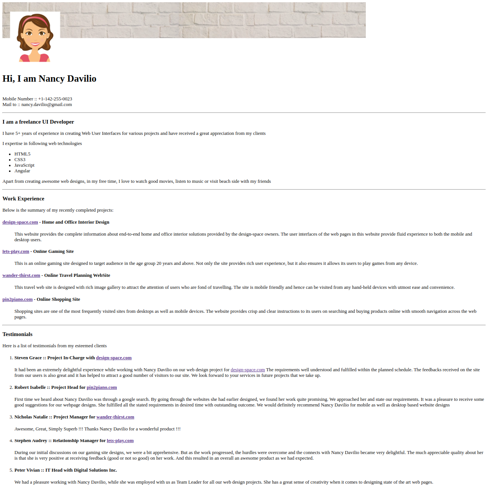

# My Profile Page

## Context

Profile Page  is like a business card to help customers, users can know the basic information of your introduce in the website. With the increasing development, the aesthetics of the profile page is also a very important factor to attract attention of users as well as bring a professional feeling to the website.

## problem Statement

Create a profile page which resembles the given image below



### Tasks

- The solution for this challenge can be developed in 4 stages:
    - Stage 1 :: Create Heading
    - Stage 2 :: Create About Me section
    - Stage 3 :: Create Work Experience section
    - Stage 4 :: Create Testimonial section
- Edit index.html file provided in the boilerplate to add various HTML elements to get the page output as shown in the image. The image file is shared with the boilerplate.
- Use appropriate tags to accomplish this outcome based on the practices performed earlier.

- The text content for the page is provided below:

```
Hi, I am Nancy Davilio

Mobile Number :: +1-142-255-0023
Mail to :: nancy.davilio@gmail.com

I am a freelance UI Developer
I have 5+ years of experience in creating Web User Interfaces for various projects and have received a great appreciation from my clients

I expertise in following web technologies

HTML5
CSS3
JavaScript
Angular
Apart from creating awesome web designs, in my free time, I love to watch good movies, listen to music or visit beach side with my friends

Work Experience
Below is the summary of my recently completed projects:

design-space.com - Home and Office Interior Design
This website provides the complete information about end-to-end home and office interior solutions provided by the design-space owners.The user interfaces of the web pages in this website provide fluid experience to both the mobile and desktop users.
lets-play.com - Online Gaming Site
This is an online gaming site designed to target audience in the age group 20 years and above. Not only the site provides rich user experience, but it also ensures it allows its users to play games from any device.
wander-thirst.com - Online Travel Planning WebSite
This travel web site is designed with rich image gallery to attract the attention of users who are fond of travelling. The site is mobile friendly and hence can be visited from any hand-held devices with utmost ease and convenience.
pin2piano.com - Online Shopping Site
Shopping sites are one of the most frequently visited sites from desktops as well as mobile devices. The website provides crisp and clear instructions to its users on searching and buying products online with smooth navigation across the web pages.
Testimonials
Here is a list of testimonials from my esteemed clients

Steven Grace :: Project In-Charge with design-space.com
It had been an extremely delightful experience while working with Nancy Davilio on our web design project for design-space.com The requirements well understood and fulfilled within the planned schedule. The feedbacks received on the site from our users is also great and it has helped to attract a good number of visitors to our site. We look forward to your services in future projects that we take up.

Robert Isabelle :: Project Head for pin2piano.com
First time we heard about Nancy Davilio was through a google search. By going through the websites she had earlier designed, we found her work quite promising. We approached her and state our requirements. It was a pleasure to receive some good suggestions for our webpage designs. She fulfilled all the stated requirements in desired time with outstanding outcome. We would definitely recommend Nancy Davilio for mobile as well as desktop based website designs

Nicholas Natalie :: Project Manager for wander-thirst.com
Awesome, Great, Simply Superb !!! Thanks Nancy Davilio for a wonderful product !!!

Stephen Audrey :: Relationship Manager for lets-play.com
During our initial discussions on our gaming site designs, we were a bit apprehensive. But as the work progressed, the hurdles were overcome and the connects with Nancy Davilio became very delightful. The much appreciable quality about her is that she is very positive at receiving feedback (good or not so good) on her work. And this resulted in an overall an awesome product as we had expected.

Peter Vivian :: IT Head with Digital Solutions Inc.
We had a pleasure working with Nancy Davilio, while she was employed with us as Team Leader for all our web design projects. She has a great sense of creativity when it comes to designing state of the art web pages.

```